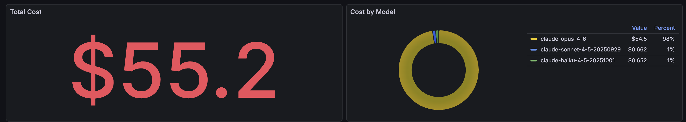
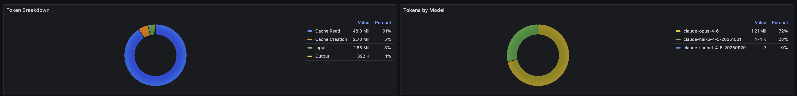
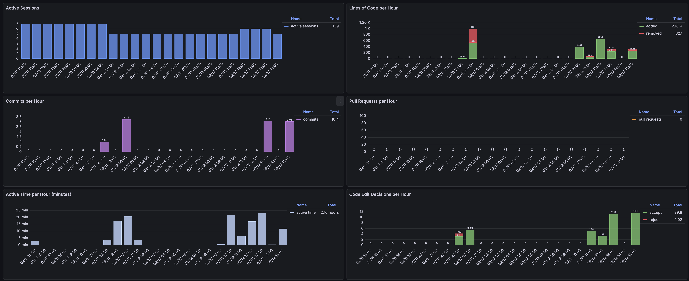
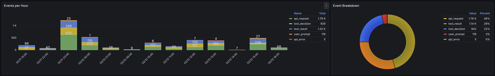
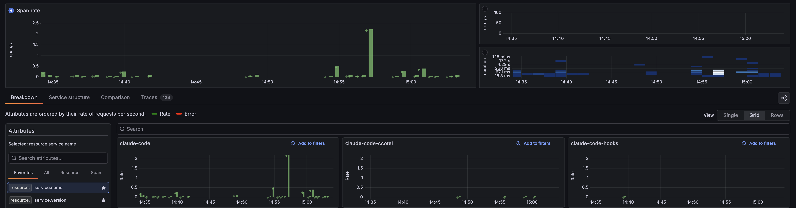

# Claude Code Observability Stack

A local observability stack for monitoring [Claude Code](https://claude.com/claude-code) CLI activity. Claude Code emits metrics and logs via OpenTelemetry -- this project collects, stores, and visualizes them using a 6-container Grafana LGTM stack.

## Architecture

```
Claude Code  --OTLP-->  OTel Collector  ---->  Prometheus (metrics)
                                         |-->  Loki (logs)
                                         |-->  Tempo (traces)
                                         |-->  Pyroscope (profiling, future)
                                               |
OTel Trace Hook  --OTLP/gRPC----------->|  Grafana (dashboards)
```

| Container | Image | Role |
|-----------|-------|------|
| otel-collector | `otel/opentelemetry-collector-contrib:0.144.0` | Receives OTLP, routes to backends |
| prometheus | `prom/prometheus:v3.9.1` | Metrics storage |
| loki | `grafana/loki:3.6.4` | Log storage |
| tempo | `grafana/tempo:2.10.0` | Trace storage |
| pyroscope | `grafana/pyroscope:1.18.0` | Continuous profiling (exploration) |
| grafana | `grafana/grafana:12.3.1` | Dashboards and visualization |

## Quick Start

### 1. Start the stack

```bash
docker compose up -d
docker compose ps          # verify all containers are healthy
```

### 2. Configure Claude Code to emit telemetry

Add these to your shell profile (or source `claude-tracer.sh` for a quick test):

```bash
export CLAUDE_CODE_ENABLE_TELEMETRY=1
export OTEL_METRICS_EXPORTER=otlp
export OTEL_LOGS_EXPORTER=otlp
export OTEL_SERVICE_NAME=claude-code
export OTEL_EXPORTER_OTLP_ENDPOINT=http://localhost:4321
export OTEL_EXPORTER_OTLP_PROTOCOL=http/protobuf
export OTEL_EXPORTER_OTLP_METRICS_TEMPORALITY_PREFERENCE=cumulative
export OTEL_LOG_USER_PROMPTS=1
export OTEL_LOG_TOOL_DETAILS=1
```

> **Important**: OTel env vars must be set in the shell, not in `~/.claude/settings.json` -- the OTel SDK initializes before `settings.json` is parsed.

### 3. Open Grafana

Browse to [http://localhost:3001](http://localhost:3001) (anonymous admin access, no login required).

## Dashboards

### Costs

Total cost and breakdown by model.



### Tokens

Token breakdown by type (cache read, cache creation, input, output) and by model.



### Activity

Sessions, lines of code, commits, PRs, active time, and code edit decisions.



### Log Explorer

Events per hour with breakdown by type (api_request, tool_result, tool_decision, user_prompt, api_error).



### Traces (via OTel Trace Hook)

Span rate and service breakdown from the [OTel trace hook](hooks/) -- visible in Grafana's built-in Drilldown/Traces view.



Also included but not shown: **API Requests**, **API Errors**, **Tool Usage**, and **OTel Collector** dashboards.

## Port Mapping

| Host Port | Service |
|-----------|---------|
| 3001 | Grafana UI |
| 4320 | OTel Collector gRPC |
| 4321 | OTel Collector HTTP (Claude Code pushes here) |
| 9092 | Prometheus API |
| 13133 | OTel Collector health check |
| 4040 | Pyroscope UI |

## Repository Structure

| Path | Description |
|------|-------------|
| `docker-compose.yml` | Defines all 6 services, ports, volumes, and healthchecks |
| `otelcol-config.yaml` | OTel Collector pipeline: receivers, processors, exporters |
| `claude-tracer.sh` | Sourceable script that sets all required OTel env vars |
| `grafana/` | Grafana datasource provisioning config |
| `dashboards/` | Provisioned Grafana dashboard JSON files and loader config |
| `prometheus/` | Prometheus config (`prometheus.yml`) |
| `loki/` | Loki config (`loki-config.yaml`) |
| `tempo/` | Tempo config (`tempo-config.yaml`) |
| `pyroscope/` | Pyroscope config (`pyroscope-config.yaml`) |
| `hooks/` | OTel trace hook -- bridges Claude Code hook events to Tempo traces |
| `scripts/` | Development tools: pre-commit quality gate checks |
| `docs/` | Deep dives, experiments, ADRs, and migration plans |
| `CLAUDE.md` | Full technical reference (architecture, telemetry schema, known issues) |

## What Claude Code Emits

**8 metrics** (Prometheus counters): session count, lines of code, commits, PRs, cost, tokens, active time, edit tool decisions.

**5 log event types** (Loki): `user_prompt`, `tool_result`, `api_request`, `api_error`, `tool_decision`.

See [CLAUDE.md](CLAUDE.md) for the full telemetry schema, Prometheus name mappings, and attribute details.

## Development Setup

After cloning, install the pre-commit hook to enable Tier 1 quality gates (JSON/YAML validation, Docker Compose checks, version pinning):

```bash
cd scripts/pre-commit && make install
```

The hook runs automatically on every `git commit` and blocks commits that introduce invalid configs or unpinned versions.

## Useful Commands

```bash
# Stop the stack (data volumes are preserved)
docker compose down

# Restart Grafana to reload provisioned dashboards
docker compose restart grafana

# Tail collector logs
docker compose logs -f otel-collector

# Check what Claude Code metrics Prometheus has
curl -s 'http://localhost:9092/api/v1/label/__name__/values' | jq '.data[] | select(startswith("claude"))'

# Check Loki for recent logs
curl -s 'http://localhost:3100/loki/api/v1/label/service_name/values' | jq
```
